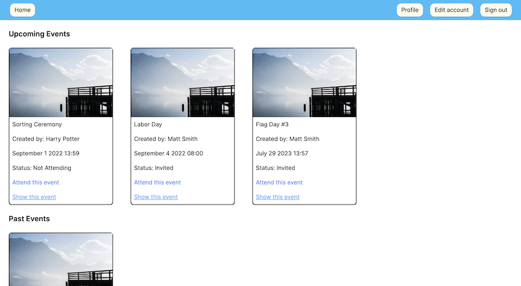
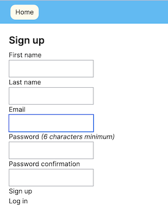
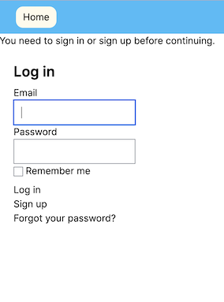
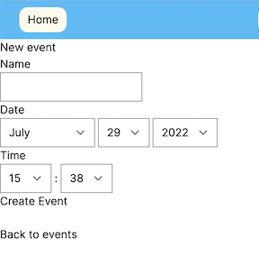
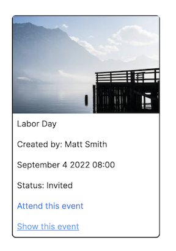
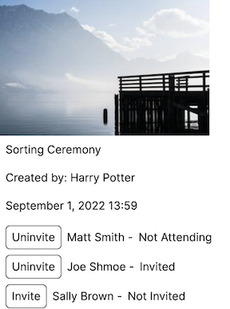

# Private Events

This event manager app allows users to create and sign-up for events. This project was completed as part of the curriculum at [The Odin Project](theodinproject.com) and is built using Ruby on Rails. Project specifications can be found [here](https://www.theodinproject.com/lessons/ruby-on-rails-private-events).

[Link to live version](https://stark-waters-80934.herokuapp.com)

## Usage

### Getting Started

You must initially sign in or create an account to access any part of the app. When opening the site, you will prompted to sign in or sign up for an account. Click "Sign up" or "Log in" and fill in the requested fields to begin.  

### The Home Page

After signing in or signing up for a new account, you will see the home page, where all events that you have access to will be displayed. If you are a new user, this screen will be mostly blank, at least until you create an event or are invited to one.

### Creating an Event

To create a new event, clink the blue "New event" link. Fill out the name of your event, the date, and the time, then click "Create event." You will then see the individual listing for the event. To invite other users to this event, click "Invite users." From this page, you can invite other users by clicking "Invite" next to their names. To return to the home page with all listed events, click "Home" at the top.

### Responding to Invites

To respond to your invites, click "Attend this event." The status will change from "Invited" to "Attending". If your plans change and you don't want to attend anymore, you can click "I am no longer attending this event" to let the host know you are busy. This will change the status to "Not Attending."

### Managing Created Events/Invites

To see just the events you have created, click the "Profile" button at the top. To manage invitations for any of your created events, click "Show this event" to go to the event listing, then click "Invite users" to see the invitation interface. Click "Invite" next to any user you would like to invite. You can also uninvite users by clicking "Uninivite" next to any invited user.

## Technologies

- Ruby (3.1.2)
- Rails (7.0.3)
- Devise (4.8)
- Tailwind CSS (2.0)

## Notes

This app was created as a learning project as part of the curriculum at [The Odin Project](theodinproject.com). For this reason, the functionality and styling have not been fully developed as they might be in a real-world app.

The main learning goals of this project were to gain familiarity with building websites with the Ruby on Rails framework. One particular area of interest was building models with associations to connect Users with Events and Invites. By experimenting with these associations< I was able to gain a better understanding of how associations work in Rails, and how to add complexity to an app using them.

Another focus was routing and forms, especially concering Invites (the through table connecting Events to the Users who want to attend them). Because the routing for this model went beyond the more basic RESTful routes for unassociated models, I was able to get a sense of how Rails controllers make sense of the routes involved. Because I wanted Users to modify their attendance status within the main events view, going beyond a basic invite#edit action helped cement many of the ideas behind Rails routing.
